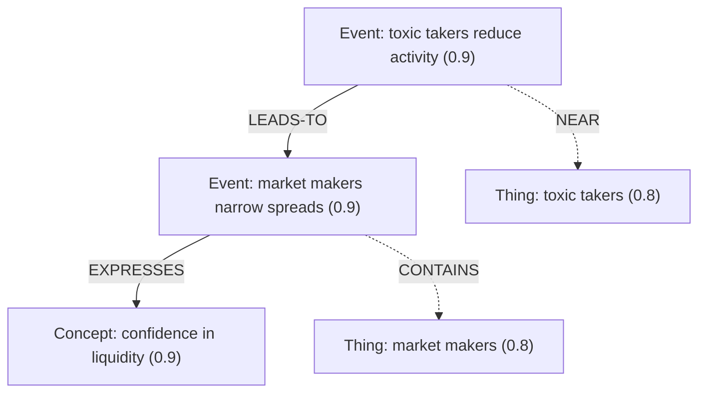

# γ(3,4) Semantic Spacetime Agent

This project builds a reasoning agent around Mark Burgess’ **Semantic Spacetime (SST)** and Promise Theory, aligned with recent work on memory-centric AI agents (SciBORG, Zep, ArcMemo, Memento).

## Core Ideas

- **Avoid the Ontology Trap**  
  Ontologies are brittle; biotech shows us to link **knowledge spaces** dynamically instead of forcing a universal taxonomy.  
  → We adopt *local graphs* with contextual edges rather than a rigid schema.

- **Nodes & Arrows in Knowledge Graphs**  
  SST distinguishes:
  - **Nodes**: events, things, concepts (γ(3,4) triad).
  - **Edges**: NEAR, LEADS-TO, CONTAINS, EXPRESSES.  
  Intentionality scores ∈ [0,1] weight nodes by information content (entropy).

- **Promise Theory & Physics**  
  Promises express **local commitments** between agents/nodes. Physics is modeled as networks of promises, showing that causality and state emerge from cooperative commitments rather than imposed laws.

- **Rescuing Property Graphs with SST**  
  Traditional property graphs lack **causality and context**. SST enriches them with temporal, semantic, and intentional structure—making graphs into *reasoning substrates*, not just storage.

## Alignment with Current Research

- **SciBORG (State and Memory is All You Need)**:contentReference[oaicite:3]{index=3}  
  Modular LLM agents with **finite-state automata (FSA) memory**. Demonstrates that structured state memory dramatically improves robustness and tool use.  
  → Our `axiom` layer enforces similar schema-driven state guarantees.

- **Zep & Graphiti (Temporal Knowledge Graphs)**:contentReference[oaicite:4]{index=4}  
  Knowledge as **episodic → semantic → community** subgraphs with temporal edges.  
  → Mirrors SST’s layering of events → things → concepts.

- **ArcMemo / Memento**  
  Memory systems that reinforce edges if used often, and allow selective forgetting.  
  → Our `reinforce_edge()` boosts intentionality scores with usage, simulating neural consolidation.

## Why This Matters

- Moves beyond **ontology-based knowledge graphs** → toward **dynamic, intentional knowledge spaces**.  
- Provides **stateful, causal reasoning** while remaining lightweight and adaptable.  
- Bridges theory (Burgess’ SST + Promise Theory) and practice (SciBORG, Zep, ArcMemo).  

## Implementation

- **Graph extraction** (`graph_agent`) builds γ(3,4) graphs from text.  
- **Reasoning agent** (`question_agent`) traverses graphs, prioritizing high-intent nodes.  
- **Axiom layer** (`validate_graph`) ensures valid knowledge graphs:
  - No causal cycles (`LEADS-TO` must be acyclic).
  - No NEAR-only links between events.
  - No self-loops.  
- **Reinforcement** updates intentionality over time (Memento-style).

See [example02_agent.py](scripts/example02_agent.py) for full implementation.

## Visual Overview




## Quick Start

```bash
# Install dependencies  
uv sync

uv run scripts/example02_agent.py
```
